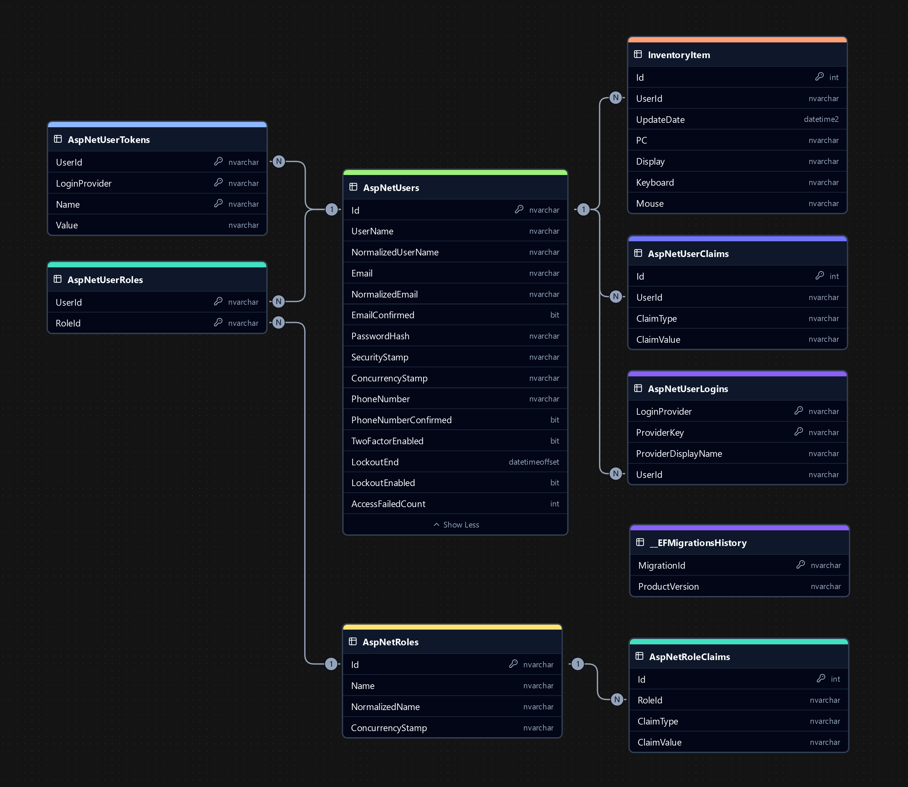

# InventoryApp

## About project
This project is an inventory management application that allows users to manage inventory items through a web interface. It uses ASP.NET Core Razor Pages and Entity Framework Core for ORM.

## Authors
### Rafał Kuczmiński
### Dominik Latosiński

## Technologies used
- .NET 8.0
- ASP.NET Core
- Entity Framework Core
- Razor Pages
- Azure SQL Server
- Azure Web App
- Github Actions

## First Launch
### Local Development
1. Clone the repository to your local machine.
2. Ensure you have the necessary environment variables set up, including `AZURE_SQL_CONNECTIONSTRING`.
3. Run the application using your preferred IDE or `dotnet run` command.
4. On the first launch, the application will automatically apply any pending migrations to the database.
5. An admin account will be created with the following credentials:
   - **Email**: admin@admin.com
   - **Password**: Admin@123
6. Use the admin account to log in and access administrator-only features.
7. To test non-admin functionality, create additional user accounts through the registration page.

## Project Structure

This project implements MVC (Model-View-Controller) using ASP.NET Core Razor Pages:
- **Models** are defined in the *Models* directory, such as `InventoryItem`.
- **Views** are defined in the *Pages* directory, such as `Index`, `Create`, and `Edit`.
- **Controllers** are implemented as Razor Page models in the *Pages* directory, such as `Index.cshtml.cs`, `Create.cshtml.cs`, and `Edit.cshtml.cs`.

Additionally, the project uses ASP.NET Core Identity for authentication and authorization.

## Object-Relational Mapping
The project extensively uses Object-Relational Mapping (ORM) with Entity Framework Core, following the Code First approach.

## Field Restrictions
### AspNetUsers Fields
- **Email**: Must be a valid email address.
- **Password**: Must be at least 6 characters long and max 100 characters long, have at least one non alphanumeric character, have at least one lowercase ('a'-'z') and have at least one uppercase ('A'-'Z').

### InventoryItem Fields
- **Id**: Auto-incremented integer.
- **UserId**: Must be a valid user ID, maximum length 450 characters. Only settable by backend.
- **UpdateDate**: Must be a valid date.
- **PC**: Optional field.
- **Display**: Optional field.
- **Keyboard**: Optional field.
- **Mouse**: Optional field.

### Migrations
- Migration files such as `20241127175442_AddInventory.cs` and `00000000000000_CreateIdentitySchema.cs` show the use of migrations to manage the database schema. These migrations are generated based on the data models and the database context.
- The file `ApplicationDbContextModelSnapshot.cs` contains a snapshot of the model, used to track changes in the data model.

### Database Connection Configuration
- The file `Program.cs` includes the configuration for connecting to a SQL Server database using `UseSqlServer`, indicating the use of Entity Framework Core for database interactions. The connection string is retrieved from the environment variable `AZURE_SQL_CONNECTIONSTRING`.

### CRUD Operations
- Razor Pages such as `Create`, `Edit`, `Delete`, and `Details` contain CRUD (Create, Read, Update, Delete) operations on the `InventoryItem` and `AspNetUsers` model using the database context.
- Pages accessible only to users with the "Administrator" role handle user management tasks such as creating, editing, and deleting user accounts. These pages ensure that only admin can perform these actions.

## User Roles
### User System Components
- **Role Management**: Roles such as "Administrator" are defined and managed using ASP.NET Core Identity. The `Program.cs` file includes code to create the "Administrator" role if it does not exist.
- **User Management**: Users are managed using ASP.NET Core Identity. The `Program.cs` file includes code to create an admin user with the email "admin@admin.com" and assign the "Administrator" role.
- **Authorization Policies**: Authorization policies are defined to restrict access to certain parts of the application. For example, the policy "RequireAdministratorRole" is defined in `Program.cs` to restrict access to administrator-only pages.

## Page Access
- **Inventory Pages**: Accessible to all registered users. These pages allow users to view, create, edit, and delete inventory items.
- **User Management Pages**: Accessible only to users with the "Administrator" role. These pages allow administrators to manage user accounts, including creating, editing, and deleting users.

## Aggregation, Filters, and Sorting
### Aggregation
- The total number of inventory items and the number of items belonging to the logged-in user are displayed on the inventory index page.

### Filters
- Users can filter inventory items to show only their own items or all items with one press of a button. This feature was added for personalization as well as testing purposes.

### Sorting
- Inventory items can be sorted by various fields such as UserId, UpdateDate, PC, Display, Keyboard, and Mouse.
- Administrators can sort other users by fields such as Id, Email, EmailConfirmed, PhoneNumber, PhoneNumberConfirmed, and Admin status.

